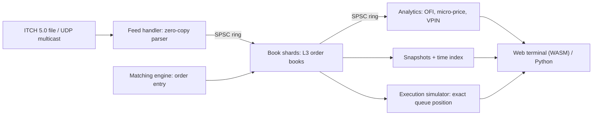

# MicrostructureLab

**An ultra-low-latency C++ limit order book engine. It replays real NASDAQ trading days, rewinds to any nanosecond in your browser, and shows exactly where your order would have been in the queue.**

> Status: **In development.** See the phase-by-phase plan in [implementation.md](implementation.md). The performance figures below are **targets**. They will be replaced with measured numbers and full methodology as each phase is completed.

---

## Why This Project Is Different

Most order book projects stop at "a `std::map` of prices tested on random orders." MicrostructureLab is built around four pillars:

| | Typical LOB project | MicrostructureLab |
|---|---|---|
| **Data** | Random synthetic orders | Full **NASDAQ TotalView-ITCH 5.0** trading days: hundreds of millions of real messages across thousands of symbols |
| **Correctness** | A few unit tests | Differential testing against a reference book, property-based invariants, libFuzzer, and **Zobrist state hashes** that confirm each replay is deterministic, one message at a time |
| **Latency** | "X million orders/sec" (an average) | p50 / p99 / p99.9 / max **per pipeline stage**, an allocation-free histogram, documented hardware, a published optimization journal, and a CI regression gate |
| **Experience** | A console printout | **The Order Book Time Machine:** the same C++ engine compiled to WebAssembly, so you can scrub any stock's book to any nanosecond in the browser, with nothing to install |

### Headline features

- **Lock-free, allocation-free hot path.** SPSC ring buffers, index-based object pools, cache-line-aware layouts, and zero heap allocations after startup. A test enforces the zero-allocation rule.
- **O(1) best-price discovery.** A dense price ladder with a 64-ary hierarchical bitmap finds the best bid or ask in three `clz`/`ctz` instructions, with no tree walk.
- **Zero-copy ITCH 5.0 parser.** Big-endian, UB-free decoding with compile-time dispatch. It is fuzzed and has been validated against a full trading day.
- **Two modes, one book.** *Reconstruction* mode rebuilds exchange books from ITCH. *Matching* mode is a price-time priority engine (Limit, Market, IOC, FOK, Post-Only).
- **Time travel.** Periodic snapshots plus a time index make seeking to any nanosecond of the day take milliseconds.
- **Execution research with exact queue position.** Place *shadow orders* into real historical flow. L3 data identifies exactly which orders are ahead of you, so fills are simulated deterministically instead of estimated. The simulator supports configurable latency models and strategies (market maker, TWAP, POV) and reports markouts and implementation shortfall.
- **Microstructure signals.** Order Flow Imbalance, queue imbalance, micro-price, VPIN, Kyle's lambda, and markouts. They use exact aggressor side from ITCH, so no Lee-Ready guessing is needed.
- **Production-style feed handling.** MoldUDP64 over UDP multicast with A/B line arbitration and gap detection.
- **Python research layer.** `nanobind` bindings and notebooks, including a replication of Cont, Kukanov & Stoikov's result that OFI explains price changes.

---

## Architecture



Each thread owns its state (the single-writer principle), and threads communicate only through lock-free SPSC rings. Engine logic runs on feed time, never wall-clock time, so every replay is bit-identical and verifiable by hash.

---

## Performance Targets

| Metric | Target |
|---|---|
| ITCH parse + dispatch | ≤ 15 ns / message |
| L3 book add | p50 ≤ 50 ns, p99 ≤ 200 ns |
| L3 book cancel / execute | p50 ≤ 40 ns, p99 ≤ 150 ns |
| Matching: aggressive order, 1 fill | p50 ≤ 150 ns, p99 ≤ 500 ns |
| Pipelined tick-to-book | p99 ≤ 1 µs, p99.9 ≤ 2 µs |
| Full-day replay throughput | ≥ 20 M messages / s (single book thread) |
| Seek to any timestamp | < 50 ms native |
| Hot-path heap allocations | 0 |

Published numbers will come from an isolated-core Linux x86 machine. The hardware, kernel, compiler, flags, and dataset will be documented in `docs/benchmarks.md`.

---

## Roadmap

| Milestone | Phases | Outcome |
|---|---|---|
| **M1: Correct** | 0–4 | Real NASDAQ days rebuilt with evidence of correctness |
| **M2: Fast** | 5–6 | Lock-free pipeline with measured, documented tail latency |
| **M3: Wow** | 7–10 | Time travel, microstructure signals, exact-queue execution simulator, browser demo |
| **M4: Complete** | 11–13 | Multicast feed handler, Python research layer, published results |

Details, tasks, and exit criteria are in [implementation.md](implementation.md).

---

## Tech Stack

- **Core:** C++20, CMake presets, Clang/GCC
- **Testing:** GoogleTest, property-based differential tests, libFuzzer, ASan/UBSan/TSan
- **Performance:** Google Benchmark, `perf`, flame graphs, a custom HdrHistogram-style recorder, PGO/LTO
- **Web:** Emscripten (WASM), TypeScript, Vite, Canvas/WebGL, GitHub Pages
- **Research:** nanobind, NumPy, pandas, Jupyter
- **CI:** GitHub Actions (sanitizer matrix, golden-hash determinism checks, instruction-count perf gate)

---

## Quick Start (planned interface)

```bash
cmake --preset release && cmake --build --preset release
ctest --preset release

# Generate a deterministic synthetic ITCH 5.0 feed and replay it
./build/release/apps/mlab-gen --seed 42 --symbols 50 --messages 10000000 -o data/synthetic.itch
./build/release/apps/mlab-replay data/synthetic.itch --stats --verify-hashes

# Replay a real NASDAQ sample day (downloaded separately, not committed)
./scripts/fetch_itch.sh
./build/release/apps/mlab-replay data/<day>.NASDAQ_ITCH50 --symbols AAPL,MSFT --stats
```

---

## Data

The project uses NASDAQ's publicly available TotalView-ITCH 5.0 sample files. Raw data is large, is never committed, and is fetched by script into `data/` (gitignored). CI uses small, deterministic synthetic ITCH feeds generated by `mlab-gen`.

---

## References

- NASDAQ TotalView-ITCH 5.0 and MoldUDP64 specifications
- Cont, Kukanov & Stoikov (2014), *The Price Impact of Order Book Events*
- Stoikov (2018), *The Micro-Price*
- Easley, López de Prado & O'Hara (2012), *Flow Toxicity and Liquidity in a High-Frequency World*
- Avellaneda & Stoikov (2008), *High-Frequency Trading in a Limit Order Book*
