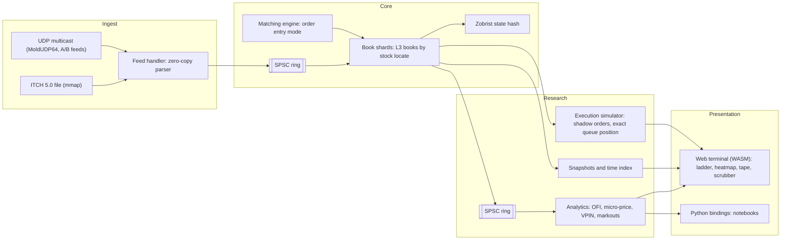

# MicrostructureLab — Phase-Wise Implementation Plan

This is the working plan for the project. Follow it phase by phase. Each phase lists its goal, design decisions, tasks, tests, exit criteria, and common mistakes. Don't start a phase until the previous phase meets its exit criteria. The only exceptions are the phases marked as parallelizable.

---

## Progress Tracker

| # | Phase | Milestone | Status |
|---|---|---|---|
| 0 | Foundations, tooling, core types | M1 | [ ] |
| 1 | Reference order book (correctness oracle) | M1 | [ ] |
| 2 | High-performance L3 order book | M1 | [ ] |
| 3 | Matching engine | M1 | [ ] |
| 4 | NASDAQ ITCH 5.0 parser and synthetic feed generator | M1 | [ ] |
| 5 | Lock-free pipeline and threading model | M2 | [ ] |
| 6 | Latency engineering and measurement | M2 | [ ] |
| 7 | Deterministic replay and time travel | M3 | [ ] |
| 8 | Microstructure analytics | M3 | [ ] |
| 9 | Execution simulator (exact queue position) | M3 | [ ] |
| 10 | Web terminal (WebAssembly) | M3 | [ ] |
| 11 | Network feed handler (MoldUDP64 / multicast) | M4 | [ ] |
| 12 | Python bindings and research notebooks | M4 | [ ] |
| 13 | Polish, benchmarks report, publication | M4 | [ ] |

**Milestones**

- **M1 — Correct:** The engine rebuilds real NASDAQ order books from ITCH data. Differential tests and fuzzing check that the books are correct.
- **M2 — Fast:** Latency is measured end to end. Results include full percentile distributions and a written optimization journal.
- **M3 — Wow:** A browser-based time machine, microstructure signals, and an execution simulator with exact queue position.
- **M4 — Complete:** A live network feed path, a Python research layer, and published results.

M1 alone is a solid project. M3 is what makes it stand out.

---

## 1. Unique Selling Point

Most limit order book projects on GitHub share the same weaknesses:

- They use `std::map<double, std::list<Order>>`, which uses floating-point prices and allocates on every insert.
- They test on random synthetic orders, not real market data.
- They report only an average latency (for example, "X million orders/sec") and don't describe how they measured it.
- They don't provide evidence that the book is correct.
- They have no visuals and nothing a non-C++ reader can try.

MicrostructureLab addresses each of these with four pillars:

1. **Real data at full scale.** The engine replays a full NASDAQ TotalView-ITCH 5.0 trading day (hundreds of millions of messages across thousands of symbols) and rebuilds every L3 order book at nanosecond resolution.
2. **Proven correctness.** Differential testing against a simple reference book, property-based tests, coverage-guided fuzzing, and **Zobrist state hashing** confirm that each replay is deterministic, one message at a time.
3. **Honest latency.** The project reports p50, p99, p99.9, and max per pipeline stage using an allocation-free histogram. It documents the hardware, OS, and compiler flags, keeps an optimization journal, and runs a CI performance regression gate.
4. **The Order Book Time Machine.** The same C++ core compiles to WebAssembly. Anyone can open a web page, choose a real stock, scrub to any nanosecond of the day, and see the depth ladder, a liquidity heatmap, and signals. They can also place a *shadow order* and see its **exact** queue position. Exact position is possible because ITCH is an order-level (L3) feed.

**One-line pitch:**
> *"A lock-free, allocation-free C++ order book engine that replays real NASDAQ days, rewinds to any nanosecond in your browser, and shows exactly where your order would have been in the queue."*

---

## 2. Engineering Principles

These rules apply to every phase. Enforce them in code review, even when you are the only reviewer.

1. **Correctness first, then speed.** Every optimized component has a simple reference implementation that it is tested against.
2. **Zero heap allocations on the hot path.** Allocate everything up front: pools, rings, and ladders. Verify this with an allocation-counting test hook (Phase 6).
3. **Fixed-point prices only.** Store prices as `int64_t` ticks and never as `double`. ITCH prices already carry 4 implied decimal places.
4. **Determinism.** Engine logic never reads the wall clock. Event time comes from the feed, and replaying the same input always produces the same state hash.
5. **Single-writer principle.** Each piece of mutable state has exactly one owning thread. Threads communicate only through SPSC rings.
6. **Measure, don't guess.** Keep every optimization only if a benchmark shows before and after numbers, and record it in `docs/optimization-journal.md`.
7. **No exceptions or RTTI on the hot path.** Use error codes or `std::expected`-style returns. Exceptions are acceptable in setup and configuration code.
8. **Portable core, platform-specific edges.** Keep the book, matching, replay, and analytics code portable C++20, because it must also compile to WASM. Keep platform code (affinity, huge pages, sockets, TSC) behind small interfaces.

---

## 3. System Architecture



### Two operating modes that share one book

| Mode | Who does the matching? | Input | Use case |
|---|---|---|---|
| **Reconstruction** | The exchange. We apply its events. | ITCH `A/F/E/C/X/D/U` messages | Rebuild real books, research, time travel |
| **Matching** | Our engine | New, cancel, and modify order requests | Exchange simulation, latency benchmarks |

Both modes use the same L3 book data structure. The execution simulator (Phase 9) connects them: it runs matching logic for *shadow* orders against a book that is being rebuilt from real data.

### Threading model (native)

```
[Feed thread] --SPSC--> [Book shard 0..N-1] --SPSC--> [Analytics/Publisher thread]
   parse, route by        apply events, update         signals, snapshots,
   stock locate           hash, emit deltas            WebSocket / file output
```

- Pin each thread to a dedicated, isolated core (Linux only; see §5).
- Threads busy-spin with a CPU pause or yield hint. They never sleep on the hot path.
- Shard books by `stock_locate % N`. Each book is owned by exactly one shard.

---

## 4. Repository Layout (target)

```
MicrostructureLab/
├── CMakeLists.txt
├── CMakePresets.json            # debug, release, asan, ubsan, tsan, bench, wasm
├── include/mlab/
│   ├── core/                    # types.hpp, clock.hpp, assert.hpp, platform.hpp
│   ├── memory/                  # object_pool.hpp, arena.hpp, huge_pages.hpp
│   ├── concurrency/             # spsc_ring.hpp, spin_wait.hpp, affinity.hpp
│   ├── book/                    # reference_book.hpp, order_book.hpp, price_ladder.hpp,
│   │                            # level_bitmap.hpp, order_index.hpp, book_manager.hpp
│   ├── matching/                # matching_engine.hpp, order_types.hpp, exec_report.hpp
│   ├── feed/itch/               # messages.hpp, parser.hpp, itch_to_book.hpp
│   ├── feed/net/                # moldudp64.hpp, mcast_rx.hpp, arbitrator.hpp
│   ├── replay/                  # replayer.hpp, snapshot.hpp, time_index.hpp, zobrist.hpp
│   ├── analytics/               # ofi.hpp, microprice.hpp, vpin.hpp, markouts.hpp, ...
│   ├── sim/                     # shadow_order.hpp, queue_tracker.hpp, latency_model.hpp,
│   │                            # strategy.hpp, strategies/
│   └── telemetry/               # histogram.hpp, stage_timer.hpp, alloc_guard.hpp
├── src/                         # non-header-only implementations
├── apps/
│   ├── mlab-replay/             # replay an ITCH file, print stats, verify hashes
│   ├── mlab-gen/                # synthetic ITCH 5.0 generator
│   ├── mlab-bench/              # end-to-end latency harness
│   ├── mlab-publish/            # ITCH file -> MoldUDP64 multicast publisher
│   ├── mlab-sim/                # execution simulator CLI
│   └── mlab-slice/              # cut symbol/time slices for the web demo
├── tests/                       # unit/, differential/, property/, scenarios/
├── fuzz/                        # libFuzzer targets
├── bench/                       # Google Benchmark microbenchmarks
├── web/                         # Vite + TypeScript frontend, wasm glue
├── python/                      # nanobind module, notebooks/
├── scripts/                     # fetch_itch.sh, run_bench.sh, perf_gate.py
├── docs/                        # architecture.md, adr/, benchmarks.md, optimization-journal.md
└── data/                        # gitignored: raw ITCH, slices, golden hashes
```

---

## 5. Platform Notes

You develop on macOS, but the published latency numbers must come from Linux.

| Concern | macOS (development) | Linux (benchmarks) |
|---|---|---|
| Thread pinning | Not supported. Affinity tags are hints only. | `pthread_setaffinity_np`, `isolcpus`, `nohz_full` |
| High-resolution timer | Apple Silicon `cntvct_el0` / `mach_absolute_time` tick at **24 MHz (~41.7 ns)**. That is too coarse for single-operation timing, so time batches of operations. | x86 `rdtscp` with an invariant TSC (sub-ns resolution). Calibrate it against `CLOCK_MONOTONIC_RAW`. |
| Profiling | Instruments (Time Profiler, CPU Counters) | `perf stat`, `perf record`, flame graphs, `perf c2c` for false sharing |
| Cache line size | **128 B** on Apple Silicon | 64 B. Use 128 B padding for SPSC indices because of the adjacent-line prefetcher. |
| Huge pages | Not available the same way | `MAP_HUGETLB` / `madvise(MADV_HUGEPAGE)` |
| Sanitizers | ASan and UBSan work. TSan works. | All sanitizers, plus Valgrind/Cachegrind |

**Recommended setup:** Develop and run correctness tests on the Mac. Run the published benchmarks on a Linux x86 machine: bare-metal or a dedicated cloud instance, with turbo boost and SMT disabled if possible and cores isolated. Record the exact machine in `docs/benchmarks.md`.

Define `mlab::kCacheLine` in `core/platform.hpp` (128 on Apple Silicon, 64 elsewhere). Use 128 for padding contended atomics on all platforms.

---

## 6. Performance Targets

These are **targets, not claims**. Replace them with measured numbers in the README once they are measured.

| Metric | Target |
|---|---|
| ITCH parse + dispatch | ≤ 15 ns / message |
| L3 book: add order | p50 ≤ 50 ns, p99 ≤ 200 ns |
| L3 book: cancel / delete / execute | p50 ≤ 40 ns, p99 ≤ 150 ns |
| Matching engine: aggressive order with 1 fill | p50 ≤ 150 ns, p99 ≤ 500 ns |
| Pipelined tick-to-book (feed thread → book shard) | p99 ≤ 1 µs, p99.9 ≤ 2 µs |
| Full-day replay throughput (single book thread) | ≥ 20 M messages / s |
| Time-travel seek to any timestamp | < 50 ms native, < 250 ms WASM (slice) |
| Heap allocations on the hot path | **0** (enforced by test) |

---

## Phase 0 — Foundations, Tooling, Core Types

**Goal:** Set up a repository in which every later phase can be built, tested, sanitized, benchmarked, and run in CI with one command.

### Tasks
- [ ] Top-level `CMakeLists.txt` (C++20, CMake ≥ 3.25) and `CMakePresets.json` with presets:
  - `debug` (`-O0 -g`, assertions on)
  - `release` (`-O3`, LTO, assertions off, portable, no `-march=native`)
  - `bench` (release + `-march=native`, frame pointers kept for profiling)
  - `asan`, `ubsan`, `tsan`
  - `wasm` (Emscripten toolchain; added in Phase 10 but reserve the name now)
- [ ] Warnings: `-Wall -Wextra -Wpedantic -Wconversion -Wshadow -Werror` for project code only.
- [ ] Dependencies via `FetchContent` (pinned tags): GoogleTest, Google Benchmark. Nothing else yet.
- [ ] `.clang-format`, `.clang-tidy` (bugprone, performance, modernize, cppcoreguidelines subset), `.editorconfig`, `.gitignore` (`build/`, `data/`).
- [ ] GitHub Actions CI with this matrix: {ubuntu clang, ubuntu gcc, macos clang} × {debug + tests, asan, ubsan}, plus a clang-tidy job.
- [ ] `include/mlab/core/types.hpp` with strong types:
  ```cpp
  namespace mlab {
  using Price     = std::int64_t;   // ticks; ITCH Price(4) = 1/10000 USD
  using Qty       = std::uint32_t;
  using OrderId   = std::uint64_t;
  using Locate    = std::uint16_t;  // ITCH stock locate code
  using Timestamp = std::uint64_t;  // ns since midnight (feed time)
  enum class Side : std::uint8_t { Buy = 0, Sell = 1 };
  }
  ```
- [ ] `core/assert.hpp`: `MLAB_ASSERT` (debug only) and `MLAB_VERIFY` (always on, for cold paths).
- [ ] `core/platform.hpp`: `kCacheLine`, `MLAB_LIKELY/UNLIKELY` (or `[[likely]]`), `MLAB_FORCE_INLINE`, `cpu_relax()` (`_mm_pause` / `__builtin_arm_yield`).
- [ ] Empty `docs/architecture.md`, `docs/optimization-journal.md`, `docs/adr/0001-record-architecture-decisions.md`.

### Exit criteria
- `cmake --preset debug && cmake --build --preset debug && ctest --preset debug` passes on macOS and in CI.
- A trivial test and a trivial benchmark run in CI.

### Pitfalls
- Don't add `-march=native` to the default release build. It breaks CI caching and the portability of binaries.
- Pin dependency versions. Floating tags make benchmarks irreproducible.

---

## Phase 1 — Reference Order Book (Correctness Oracle)

**Goal:** Write a deliberately simple, obviously correct L3 order book. It is never optimized, and it stays in the repository permanently as the test oracle for Phases 2, 3, 7, and 9.

### Design
- `std::map<Price, std::list<Order>, std::greater<>>` for bids, `std::map<Price, std::list<Order>>` for asks.
- `std::unordered_map<OrderId, iterator-handle>` for lookup.
- Operations (these match the ITCH semantics):
  - `add(id, side, price, qty)`
  - `execute(id, qty)`: reduce the quantity and remove the order at zero
  - `cancel(id, qty)`: partial cancel
  - `remove(id)`: full delete
  - `replace(old_id, new_id, price, qty)`: the order loses priority and gets a new id
- Queries:
  - `best_bid()`, `best_ask()`
  - `level(side, price) → {total_qty, order_count}`
  - `depth(side, n) → top-n levels`
  - `queue_position(id) → qty ahead`
  - `for_each_order(...)`

### Tasks
- [ ] Implement `ReferenceBook` in `book/reference_book.hpp`.
- [ ] Write scenario tests as tables of operations and expected states (FIFO priority, partial fills, replace losing priority, removing the last order at a level, empty book queries).
- [ ] Implement a canonical `dump()` that prints the full book state as sorted, deterministic text, for diffing in tests.

### Exit criteria
- 100% line coverage on `ReferenceBook` (use `llvm-cov`).
- Every operation is documented with its exact semantics, including edge cases such as executing more than the resting quantity (this is an error, and must be reported).

---

## Phase 2 — High-Performance L3 Order Book

**Goal:** An allocation-free L3 book that has the same observable behavior as `ReferenceBook` and is about 10–50× faster.

### Design

**Order storage: index-based object pool**
```cpp
struct Order {            // 32 bytes -> 2 per 64 B line, 4 per 128 B line
  OrderId       id;       // 8
  Price         price;    // 8
  Qty           qty;      // 4
  std::uint32_t prev;     // 4  pool index, kNil = UINT32_MAX
  std::uint32_t next;     // 4
  std::uint32_t level;    // 4  index of owning price level (side derivable)
};
static_assert(sizeof(Order) == 32);
```
- 32-bit indices instead of pointers halve the size of each link and improve cache density.
- The pool is a preallocated array plus an intrusive free list. `acquire()` and `release()` are O(1) and never allocate.

**Price levels: dense ladder plus a hierarchical bitmap**
- Each side has a price ladder: an array of `Level { Qty total; uint32_t count; uint32_t head; uint32_t tail; }`, indexed by `(price - base) / tick`.
- The window is centered on the first seen price and re-centered (rebuilt) if prices drift out of range. Prices outside the window go to a small sparse fallback map. Count how often each case occurs.
- A **hierarchical bitmap** (64-ary, three levels, 262,144 slots) marks non-empty levels. The best bid is the highest set bit and the best ask is the lowest. Each lookup takes three `clz`/`ctz` instructions, with no tree walk.
- Cache the top of book (best price and quantity per side) and update it on every change.

**Order lookup: pluggable policy, choose by benchmark**
- `OpenAddressingIndex`: power-of-two table, linear probing, backward-shift deletion (no tombstones), and a hash of `OrderId` (splitmix64). This is the default.
- `PagedDirectIndex`: ITCH order reference numbers are unique for the day and roughly increasing. A lazily committed, `mmap`'d sparse array (`MAP_NORESERVE`) maps each id to a pool index with no hashing. Benchmark it against the hash index and record the result in an ADR.

**Book manager**
- `BookManager` holds an array of books indexed by `Locate`, because ITCH locate codes are dense and small. Symbol metadata comes from ITCH `R` (Stock Directory) messages.

### Tasks
- [ ] `memory/object_pool.hpp` (index-based, free list, capacity fixed at construction).
- [ ] `book/level_bitmap.hpp` + unit tests (set/clear/find_highest/find_lowest/find_next_below/above).
- [ ] `book/price_ladder.hpp` with re-centering and the sparse fallback.
- [ ] `book/order_index.hpp` (both policies).
- [ ] `book/order_book.hpp`, templated on the index policy, with the same API as `ReferenceBook`.
- [ ] **Differential test harness** (`tests/differential/`): a seeded random operation generator with realistic mixes (many cancels, clustered prices, occasional far-away prices and replaces). Apply every operation to both books and compare the full `dump()` periodically and the top of book after every operation. Run 10⁷+ operations per seed across many seeds in CI nightly.
- [ ] Microbenchmarks (`bench/book_bench.cpp`): add, cancel, execute, replace, best-price lookup, and a realistic mix. Compare `std::map` (ReferenceBook) with OrderBook for each index policy.

### Exit criteria
- The differential test passes for 10⁸ operations across 100 seeds with ASan and UBSan enabled.
- Benchmarks show a large speedup over the reference book, recorded in the journal.
- Zero allocations after construction (checked by the alloc guard; a temporary version is fine until Phase 6).

### Pitfalls
- Re-centering the ladder is the hard edge case. Test it explicitly with prices that drift across the window boundary.
- Don't store `Side` in `Order` if it can be derived. Every byte of `Order` counts.
- Bitmap `find_next_below` has off-by-one bugs at word boundaries. Property-test it against a `std::set`.

---

## Phase 3 — Matching Engine

**Goal:** A price-time priority matching engine built on the Phase 2 book. It powers "exchange mode", end-to-end latency benchmarks, and the shadow matching in Phase 9.

### Design
- **Order types:** Limit (GTC/Day), Market, IOC, FOK, Post-Only.
- **Actions:**
  - New order
  - Cancel
  - Modify: reducing the quantity keeps priority; increasing the quantity or changing the price loses priority
- **Outputs** go to an output buffer:
  - `Ack`, `Reject{reason}`, `Fill{maker_id, taker_id, price, qty}`, `Cancelled`, `Modified`
  - Every output carries a monotonically increasing sequence number.
- Fills execute at the **maker's** price.
- Self-trade prevention is optional (cancel-newest). Keep it behind a flag.
- No allocations. The output is a caller-provided span or ring.

### Tasks
- [ ] `matching/order_types.hpp`, `matching/exec_report.hpp`, `matching/matching_engine.hpp`.
- [ ] A reference matcher built on `ReferenceBook` for differential testing.
- [ ] Scenario tests: walking multiple levels, partial fills, FOK rejected when liquidity is insufficient, a post-only order that would cross (rejected), an IOC remainder being cancelled, modify semantics, and price-time priority across equal prices.
- [ ] **Property tests** (invariants checked after every operation):
  - The book is never crossed at rest (`best_bid < best_ask`).
  - Quantity is conserved: submitted = filled + resting + cancelled + rejected.
  - Fills are never at a worse price than the taker's limit.
  - FIFO holds within a price level.
- [ ] Benchmarks: passive add, aggressive order with 1/5/20 fills, cancel-heavy workload.

### Exit criteria
- The differential and property tests pass for 10⁷+ random requests with sanitizers enabled.
- Latency benchmarks are recorded in the journal.

---

## Phase 4 — NASDAQ ITCH 5.0 Parser and Synthetic Feed Generator

**Goal:** Parse real NASDAQ TotalView-ITCH 5.0 binary data with zero copies, and rebuild every book for a full trading day. This completes **Milestone M1**.

### Data
- NASDAQ publishes sample ITCH 5.0 files, each a full trading day of several GB compressed, on its public EMI/FTP site. Write `scripts/fetch_itch.sh` to download a file, verify its checksum, and store it under `data/` (gitignored).
- Sample file framing: each message is preceded by a 2-byte big-endian length.
- Read the specification carefully: *NASDAQ TotalView-ITCH 5.0 Specification* (PDF from NASDAQ).

### Message coverage

| Type | Name | Action |
|---|---|---|
| `S` | System Event | Session state (start/end of messages, market hours) |
| `R` | Stock Directory | Register symbol ↔ locate, round lot, etc. |
| `H` | Stock Trading Action | Halt, pause, and resume state per symbol |
| `A` / `F` | Add Order (no MPID / with MPID) | `book.add` |
| `E` | Order Executed | `book.execute` + trade print |
| `C` | Order Executed With Price | `book.execute` + trade print only if the printable flag = `Y` |
| `X` | Order Cancel | `book.cancel` (partial) |
| `D` | Order Delete | `book.remove` |
| `U` | Order Replace | `book.replace` (new ref number, loses priority) |
| `P` | Trade (non-cross) | Trade print only (non-displayed liquidity, no book change) |
| `Q` | Cross Trade | Opening/closing cross print |
| `B` | Broken Trade | Record only |
| `Y, L, V, W, K, J, h, I, N, O` | Other | Parse and count; handle where relevant |

- Timestamps are **6 bytes** (48-bit nanoseconds since midnight).
- Order reference numbers are 8 bytes. Prices are 4 bytes with 4 implied decimal places.
- `E`, `C`, `X`, `D`, and `U` messages don't include the side or price. You must look them up by order reference, which is why the order index matters.

### Design
- `mmap` the file, or stream a `.gz` file through a decompression buffer. The parser works on `std::span<const std::byte>`.
- Load big-endian fields with `std::memcpy` into a local and `__builtin_bswap*`. **Never** `reinterpret_cast` into packed structs, because unaligned access is UB and hurts portability to WASM.
- Dispatch with a `switch` on the message type byte to a compile-time handler, CRTP or a template `Handler&`. No virtual calls.
- `ItchToBook` is the handler that maps messages to `BookManager` operations and emits trade prints.
- `mlab-replay` CLI: `mlab-replay <file> [--symbols AAPL,MSFT] [--stats] [--dump-top N at T]`.

### Synthetic generator (`mlab-gen`)
- Writes **valid ITCH 5.0 binary** so that the whole pipeline can be tested in CI without the multi-GB files.
- Model: Poisson order arrivals; prices drawn around a random-walk mid with a power-law distance from the touch; realistic cancel-to-add ratio (cancels dominate); executions against the touch; occasional replaces.
- Deterministic for a given `--seed`. Generate small fixtures (about 10⁶ messages) in CI.

### Validation (this matters: it is how you show the book is right)
- [ ] Message counts per type match an independent count (Python script using `struct`).
- [ ] **No crossed books** during continuous trading for any symbol. Log violations with context. Expect some around crosses and halts, and document them.
- [ ] Every `E`/`C`/`X`/`D`/`U` refers to a live order (zero "unknown order" errors).
- [ ] At end of day, every book is either empty or contains only orders that are legitimately still resting. Document what you find.
- [ ] Spot check: compare the reconstructed top of book and trade prints for a few symbols (such as AAPL) against a trusted external source, if one is available.

### Tasks
- [ ] `feed/itch/messages.hpp` (message layouts as constants and offsets), `parser.hpp`, `itch_to_book.hpp`.
- [ ] `apps/mlab-replay`, `apps/mlab-gen`, `scripts/fetch_itch.sh`.
- [ ] **libFuzzer target** `fuzz/itch_parser_fuzz.cpp`: random bytes must never crash the parser, cause UB, or read out of bounds. Run it in CI for a short fixed time, and for longer runs locally.
- [ ] Parser benchmark (ns per message, GB/s).

### Exit criteria (Milestone M1)
- A full NASDAQ sample day replays with **zero** unknown-order errors, and the validation report is committed to `docs/validation.md`.
- Fuzzing runs with no crashes.
- CI replays a synthetic fixture and checks the golden end-state dump (golden hashes arrive in Phase 7).

### Pitfalls
- Locate codes are **per day**. Never hard-code symbol ↔ locate mappings.
- `C` messages with the printable flag `N` must not produce a trade print, although they still reduce the book.
- `U` (replace) removes the old reference and creates a new one on the same side. The side is not in the message.
- Keep timestamps as `uint64_t`. A 48-bit value doesn't fit in `uint32_t`.

---

## Phase 5 — Lock-Free Pipeline and Threading Model

**Goal:** Split the work across pinned threads connected by lock-free SPSC rings without losing determinism.

### Design

**SPSC ring**
```cpp
template <typename T, std::size_t N>   // N is a power of two
class SpscRing {
  alignas(128) std::atomic<std::size_t> head_{0};   // written by consumer
  alignas(128) std::size_t              cached_tail_{0};
  alignas(128) std::atomic<std::size_t> tail_{0};   // written by producer
  alignas(128) std::size_t              cached_head_{0};
  alignas(128) std::array<T, N>         buf_;
public:
  bool try_push(const T&) noexcept;
  bool try_pop(T&) noexcept;
  // batch variants: claim k slots, publish once
};
```
- `acquire`/`release` ordering only. Never `seq_cst` on the hot path.
- **Cached opposite index:** the producer rereads `head_` only when the ring appears full. This greatly reduces cache-line traffic between cores.
- Batch publication: publish the index once per batch of messages.
- Message type: a fixed-size tagged struct of about 32–64 B, containing the decoded event plus the feed timestamp plus the receive TSC.

**Threads**
- Feed thread: parse, then route to a shard by `locate % N`.
- Book shards: apply events and emit book deltas and top-of-book changes downstream.
- Analytics/publisher thread: consumes the deltas.
- Busy-spin with `cpu_relax()`. Provide a `--spin=false` option with a backoff for laptops.
- `concurrency/affinity.hpp`: pinning on Linux, a no-op with a warning on macOS.

### Tasks
- [ ] `concurrency/spsc_ring.hpp` + unit tests + **TSan stress test** (billions of items, with sequence checks on the consumer side).
- [ ] Ring benchmarks: throughput, and ping-pong round-trip latency between two pinned cores.
- [ ] Pipeline assembly in `mlab-replay --threads N`.
- [ ] **Determinism check:** the per-book state after a replay is identical for single-threaded and N-thread modes (verified by the Phase 7 hashes; use full dumps until then).

### Exit criteria
- TSan is clean. Stress tests pass. The pipelined replay gives the same results as the single-threaded replay.
- Ring latency and throughput numbers are recorded.

### Pitfalls
- False sharing between `head_` and `tail_`. Verify with `perf c2c` on Linux.
- A multi-symbol message such as a system event must reach **all** shards. Handle this broadcast explicitly.
- A full ring means backpressure. Decide on a policy (block or spin) and count how often it happens.

---

## Phase 6 — Latency Engineering and Measurement

**Goal:** Honest, reproducible latency numbers, and a documented optimization process. This completes **Milestone M2**.

### Measurement infrastructure (build this first)
- [ ] `telemetry/clock.hpp`: `rdtscp` + `lfence` on x86 (with TSC-frequency calibration), `cntvct_el0` on ARM64, and a `steady_clock` fallback. Wrap them in a `Timestamp now_ticks()` / `to_ns()` interface.
- [ ] `telemetry/histogram.hpp`: an **allocation-free log-linear histogram** in the style of HdrHistogram, with a fixed bucket array, ~1% relative precision, and recording in a few ns. Supports merging, percentiles, and a text or JSON dump.
- [ ] `telemetry/stage_timer.hpp`: per-stage timestamps carried inside ring messages (recv → parsed → book-applied → analytics-done).
- [ ] `telemetry/alloc_guard.hpp`: overrides global `operator new` in test and benchmark builds to count allocations. Tests assert **zero** allocations during the steady-state replay.
- [ ] `apps/mlab-bench`: replays a dataset and prints p50/p90/p99/p99.9/p99.99/max per stage plus throughput, in both human-readable and JSON form.

### Optimization loop
For each candidate:
1. State a hypothesis.
2. Measure a baseline (`perf stat`: cycles, instructions, IPC, L1/LLC misses, branch misses).
3. Make the change.
4. Measure again.
5. Keep or revert the change.
6. **Write an entry in `docs/optimization-journal.md`.**

Candidate techniques:
- [ ] Data layout: field ordering in `Order`/`Level`; hot and cold splitting.
- [ ] Software prefetch of the order-index slot and the level for the *next* message in the batch.
- [ ] Huge pages for the pools, index, and ladders (TLB misses dominate large order tables).
- [ ] Branch layout: `[[likely]]` on the add, cancel, and execute paths; cold paths moved to `[[gnu::cold]]` functions.
- [ ] LTO + **PGO** (profile-guided optimization) trained on a real ITCH day.
- [ ] Hash function and load factor tuning for the order index.
- [ ] Memory pre-faulting (touch every page at startup) so that page faults don't show up as tail latency.
- [ ] Linux system tuning (documented, not required): `isolcpus`, `nohz_full`, IRQ affinity, a fixed CPU frequency governor, SMT off.

### CI performance regression gate
- Wall-clock time on shared CI runners is noisy, so gate on **instruction counts** from `valgrind --tool=cachegrind`, or `perf stat -e instructions` where available, for fixed microbenchmarks. Fail the build if the count regresses by more than 3%.
- `scripts/perf_gate.py` compares the current count with a committed baseline JSON file.

### Exit criteria (Milestone M2)
- `docs/benchmarks.md` with the hardware, OS, kernel, compiler, flags, dataset, method, and full percentile tables.
- At least 8 journal entries with before and after numbers, including failed experiments, which are just as valuable.
- The zero-allocation test passes, and the perf gate is active in CI.

### Pitfalls
- Coordinated omission: when measuring under load, timestamp at the *intended* send time, not the actual send time.
- Don't report averages. Report percentiles and the max.
- `-march=native` results aren't comparable across machines. Always state the CPU.

---

## Phase 7 — Deterministic Replay and Time Travel

**Goal:** Jump to any nanosecond of the trading day in milliseconds, and prove that every replay is bit-identical.

### Design

**Zobrist state hashing**
- Each live order contributes `H(order) = mix(id, price, qty, side)`, where `mix` is splitmix64-based.
- `book_hash = XOR over live orders`.
- Updating the hash costs O(1) per event: XOR out the old contribution and XOR in the new one. Hashing is therefore cheap enough to leave on all the time.
- `global_hash = XOR` over book hashes, combined with the message sequence number.
- Store golden hashes every N messages for the synthetic CI fixtures (and for sample days locally). Any divergence pinpoints the exact message where two builds, thread counts, or platforms disagree.

**Snapshots and time index**
- Every K messages (configurable, for example 1–5 M), serialize the full state of all books into a compact binary snapshot. Store it with the ITCH file offset and the feed timestamp at that point.
- `TimeIndex`: a sorted array of `(timestamp, file_offset, snapshot_id)`.
- `seek(t)`: binary-search the latest snapshot at or before `t`, restore it, then replay forward to exactly `t`. The cost is bounded by K messages.
- Per-symbol slices (for the web): the same mechanism restricted to one locate. Snapshots are tiny.

**Replay controls:** max speed, real-time (paced by feed timestamps), ×N speed, step by message, and step by event on the selected symbol.

### Tasks
- [ ] `replay/zobrist.hpp`, integrated into `OrderBook` (behind a compile-time flag, so that its cost can be measured, and on by default).
- [ ] `replay/snapshot.hpp`: a versioned binary format with a header (version, dataset id, message sequence number, hash).
- [ ] `replay/time_index.hpp`, `replay/replayer.hpp` with `seek`, `step`, and `run_until`.
- [ ] Golden-hash test in CI for the synthetic fixtures, covering single-threaded, multi-threaded, ASan, and macOS vs Linux.
- [ ] Round-trip test: snapshot → restore → dump is identical to the original.
- [ ] Seek benchmark: random seeks across the day, reporting p50 and p99.

### Exit criteria
- Golden hashes match across platforms and thread counts.
- Seek meets the target (< 50 ms native).

---

## Phase 8 — Microstructure Analytics

**Goal:** Compute research-grade signals as streams from the rebuilt books, with O(1) cost per event and zero allocations.

*Can run in parallel with Phase 9 after Phase 7.*

### Signals

| Signal | Definition / notes |
|---|---|
| Spread, mid | $s = P^a - P^b$, $m = (P^a + P^b)/2$ |
| Queue imbalance | $I = \dfrac{Q^b - Q^a}{Q^b + Q^a}$ at the touch (and at depth-weighted levels) |
| Weighted mid | $\tilde{m} = \dfrac{P^b Q^a + P^a Q^b}{Q^a + Q^b}$; Stoikov micro-price as a stretch goal |
| Order Flow Imbalance (Cont, Kukanov & Stoikov, 2014) | $e_n = \mathbb{1}_{\{P^b_n \ge P^b_{n-1}\}} q^b_n - \mathbb{1}_{\{P^b_n \le P^b_{n-1}\}} q^b_{n-1} - \mathbb{1}_{\{P^a_n \le P^a_{n-1}\}} q^a_n + \mathbb{1}_{\{P^a_n \ge P^a_{n-1}\}} q^a_{n-1}$, summed over time buckets |
| Trade sign / aggressor | Exact from ITCH: executing a resting **buy** order means the aggressor sold. No Lee-Ready guessing is needed. |
| Trade flow imbalance | Signed volume over rolling windows |
| Realized variance | Of the mid, sampled on a clock (1 s) and in event time |
| VPIN (Easley, López de Prado & O'Hara, 2012) | Volume buckets; with exact trade signs, no bulk-volume classification is needed |
| Kyle's lambda | Rolling regression of $\Delta m$ on signed volume |
| Markouts | Mid move at +100 ms / 1 s / 5 s / 30 s after each trade, by aggressor side |
| Order lifetime / cancel-to-trade ratio | Distribution of the time from add to cancel; share of orders that ever trade |

### Tasks
- [ ] `analytics/*.hpp`: each signal is a small struct with `on_book_update`, `on_trade`, and `on_clock` hooks.
- [ ] Output sinks: a compact binary columnar format plus a CSV writer; Parquet via Arrow as an optional dependency.
- [ ] **Validate against Python:** export raw top-of-book and trade data, recompute each signal in pandas, and assert equality within tolerance (a test in `python/tests/`).
- [ ] `mlab-replay --analytics ofi,imbalance,markouts --symbols AAPL`.

### Exit criteria
- Every signal agrees with the pandas reference.
- The analytics thread keeps up with full-day replay at max speed with no backpressure.

---

## Phase 9 — Execution Simulator (Exact Queue Position)

**Goal:** Answer the question *"If I had placed this order at this time, when would it have filled, and was it a good fill?"*. Use **exact** queue position from L3 data instead of the probabilistic models that L2-only simulators rely on.

*Can run in parallel with Phase 8 after Phase 7.*

### Design

**Shadow orders.** Simulated orders are overlaid on the real replayed book. They never change the real flow (the no-impact assumption; see limitations below).

**Exact queue tracking (the key insight)**
- When a passive shadow order joins price level `p` at time `t`, record `qty_ahead`: the total quantity of real orders at `p` with earlier priority. With L3 data, this set of orders is known exactly.
- A real **execution** at `p` reduces `qty_ahead` first. Once `qty_ahead` reaches 0, further executions fill the shadow order.
- A real **cancel** or **delete** of an order *ahead* of us reduces `qty_ahead`. A cancel of an order *behind* us has no effect. Because the engine knows the position of every order, it can tell these cases apart. An L2 feed can't.
- A real replace moves the order to the back of the queue, which reduces `qty_ahead` if the order was ahead of us.
- If the price moves through our level (the opposite side trades through), we are filled at our price.

**Aggressive shadow orders** walk the visible book without removing real liquidity. Report both "naive" fills (no impact) and fills under an optional linear or square-root temporary impact model.

**Latency model**
- Configurable market-data latency, order-entry latency, and cancel latency, drawn from fixed, normal, or empirical distributions.
- A shadow order becomes active only at `t_decision + entry_latency`. The queue position is measured *at arrival*, not at decision time.

**Strategy API**
```cpp
struct Strategy {
  virtual void on_book(const BookView&, Timestamp) = 0;
  virtual void on_trade(const TradePrint&) = 0;
  virtual void on_fill(const ShadowFill&) = 0;
  virtual void on_timer(Timestamp) = 0;
};
```
The interface is virtual because strategies are off the hot path and flexibility matters more here. The engine stays template-based.

**Built-in strategies**
- Passive market maker with inventory skew (Avellaneda–Stoikov style quotes)
- TWAP
- POV (percentage of volume)
- Imbalance-triggered taker (uses the Phase 8 signals)

**Metrics**
- Fill rate and time to fill
- Implementation shortfall vs arrival mid
- Markouts of our fills at +1 s, +5 s, and +30 s (adverse selection)
- Inventory path and PnL with configurable fees and rebates
- Queue-position-at-arrival distribution

### Tasks
- [ ] `sim/queue_tracker.hpp`, with a unit test against hand-built L3 scenarios (cancels ahead, cancels behind, replace ahead, trade-through).
- [ ] `sim/latency_model.hpp`, `sim/shadow_book.hpp`, `sim/strategy.hpp`, `sim/strategies/*`.
- [ ] `apps/mlab-sim --strategy mm --symbol AAPL --from 09:45 --to 15:45 --entry-latency 5us`.
- [ ] Report: a JSON file plus a Python notebook for plots.
- [ ] **Limitations section** in the docs: no market impact on real flow, no hidden or midpoint liquidity (not in ITCH), and fees are approximate.

### Exit criteria
- Queue tracker scenario tests pass, and a fuzzed differential test agrees with a brute-force recomputation of `qty_ahead` from the reference book.
- A market-making report is produced for at least one real symbol and day.

---

## Phase 10 — Web Terminal (WebAssembly): "The Order Book Time Machine"

**Goal:** The wow demo. A zero-install web page, hosted on GitHub Pages, that runs the **same C++ engine** in the browser. This completes **Milestone M3**.

### Design
- **Engine in WASM:** compile the book, replay, time index, analytics, and queue tracker with Emscripten (`wasm` preset). Expose a small C API (`mlab_load`, `mlab_seek`, `mlab_step`, `mlab_top_n`, `mlab_heatmap_tile`, `mlab_place_shadow`, ...) through `embind` or plain `extern "C"`.
- **Data:** use `apps/mlab-slice` to cut a symbol and time-window slice (for example, AAPL 09:30–10:30) with its own snapshots into a few MB, then compress it. Ship 3–5 curated slices, such as the opening auction, a volatile minute, and a quiet midday period.
- **Run the engine in a Web Worker** so that the UI thread only renders. Move data between them with **transferable `ArrayBuffer`s**. `SharedArrayBuffer` needs COOP/COEP headers, which GitHub Pages doesn't set (you can work around this with a service-worker shim, but it's optional).
- **Frontend:** Vite + TypeScript, with Canvas2D and later WebGL. No heavy framework is needed.

### UI panels
1. **Depth ladder:** price levels with bid and ask sizes, where the size changes flash.
2. **Liquidity heatmap:** a price × time image of resting size (in the style of Bookmap), with trades overlaid as bubbles sized by volume and colored by aggressor.
3. **Timeline scrubber:** drag to any time. Snapshot plus replay-forward keeps it responsive. Includes step-by-message buttons.
4. **Trade tape** with exact aggressor side.
5. **Signals panel:** spread, imbalance, OFI, and weighted mid over time.
6. **Queue position visualizer:** click a price to place a shadow order, then watch the orders ahead of you get cancelled or executed until you fill (or don't).
7. **Stats footer:** messages per second processed *in the browser*, and the current state hash.

### Tasks
- [ ] `wasm` CMake preset; the CI job builds the WASM artifacts.
- [ ] `apps/mlab-slice`.
- [ ] `web/`: worker, engine bindings, panels, scrubber, URL deep links (`?sym=AAPL&t=09:31:04.123456789`).
- [ ] A GitHub Actions workflow deploys `web/dist` plus the slices to GitHub Pages.
- [ ] Optional live mode: a native `mlab-replay --serve` streams deltas over WebSocket to the same UI.

### Exit criteria (Milestone M3)
- The public URL loads in under 3 s on broadband, the scrubber seeks in under 250 ms, and a shadow order can be placed and tracked until it fills.
- A 30–60 s demo GIF or video is linked at the top of the README.

### Pitfalls
- 64-bit integers crossing the JS boundary: use `BigInt`, or split values into two 32-bit halves. Timestamps in nanoseconds exceed 2^53.
- Keep WASM memory growth bounded. Preallocate for the slice size.

---

## Phase 11 — Network Feed Handler (MoldUDP64 / Multicast)

**Goal:** Receive ITCH the way production systems do: MoldUDP64 over UDP multicast, with A/B line arbitration and gap handling.

### Design
- **MoldUDP64:** the header is `session (10 B)`, `sequence number (8 B)`, and `message count (2 B)`, followed by length-prefixed ITCH messages.
- **`mlab-publish`:** reads an ITCH file and publishes MoldUDP64 packets to a multicast group at a configurable rate. It can optionally send duplicate A and B streams and inject drops or reordering for testing.
- **Receiver:** a non-blocking socket, `recvmmsg` batching on Linux, `SO_TIMESTAMPING` for kernel receive timestamps, and busy polling.
- **A/B arbitration:** take whichever copy of each sequence number arrives first and drop duplicates.
- **Gap detection:** a gap on both lines triggers a (simulated) retransmission request, or recovery from a snapshot. Record gap statistics.
- **Kernel bypass (documented future work):** AF_XDP, DPDK, Solarflare `ef_vi`/Onload. Explain the latency they would save and why they are out of scope.

### Tasks
- [ ] `feed/net/moldudp64.hpp` (+ fuzz target), `mcast_rx.hpp`, `arbitrator.hpp`.
- [ ] `apps/mlab-publish`.
- [ ] Tests: loopback end-to-end publish → receive → rebuild, with injected A/B drops. The final state hash must equal the file replay hash.
- [ ] Wire-to-book latency measurement (kernel timestamp → book applied).

### Exit criteria
- Replay over the network with a 1% random drop per line and A/B arbitration produces the **same final Zobrist hash** as the file replay.

---

## Phase 12 — Python Bindings and Research Notebooks

**Goal:** Make the engine usable for quantitative research, and connect it to the QuantBacktest project.

### Tasks
- [ ] `python/`: a `nanobind` module (`mlab`) exposing `Replayer`, `seek`, `top_n`, analytics streams as NumPy arrays without copies, and `run_sim(config) -> report`.
- [ ] Packaging with `scikit-build-core`: `pip install -e python/`.
- [ ] Notebooks:
  1. **Anatomy of a trading day:** message rates, the U-shaped intraday volume, cancel-to-trade ratios, and order lifetimes.
  2. **OFI explains price changes:** reproduce the linear relationship between OFI and mid-price change from Cont, Kukanov & Stoikov (2014), and report R² per symbol.
  3. **Queue position and fill probability:** how the queue position at arrival predicts fill probability and adverse selection.
  4. **Market maker under latency:** PnL and markouts as a function of entry latency (1 µs → 1 ms). This shows *why* low latency matters.
- [ ] Export signal files that the QuantBacktest project can load as alpha features.

### Exit criteria
- The notebooks run top to bottom from a clean environment on a sample slice and are committed with their outputs.

---

## Phase 13 — Polish, Benchmark Report, Publication

**Goal:** Turn the project into something recruiters and engineers can read and understand in 30 seconds and explore for 30 minutes.

### Tasks
- [ ] README: demo GIF at the top, **measured** benchmark table (replacing the targets), architecture diagram, and quick start.
- [ ] `docs/architecture.md`: components, threading, memory layout diagrams, and data flow.
- [ ] `docs/adr/`: one ADR per major decision (index policy, ladder vs tree, ring design, snapshot interval, WASM worker design).
- [ ] `docs/benchmarks.md`: finalized, reproducible with `scripts/run_bench.sh`.
- [ ] `docs/validation.md`: evidence that the reconstruction is correct.
- [ ] A blog post or long-form write-up based on the optimization journal: "From `std::map` to X ns: building a sub-microsecond order book".
- [ ] Tag `v1.0.0` and create a GitHub release with prebuilt binaries for Linux and macOS.

### Exit criteria
- A fresh clone, followed by the quick start, reproduces the synthetic benchmark and the tests on a new machine.

---

## Cross-Cutting: Testing Strategy

| Layer | Technique | Where |
|---|---|---|
| Units | GoogleTest | `tests/unit/` |
| Behavior | Hand-written scenario tables | `tests/scenarios/` |
| Equivalence | Differential tests against the reference book and reference matcher | `tests/differential/` |
| Invariants | Property-based random testing (seeded, reproducible) | `tests/property/` |
| Robustness | libFuzzer for the ITCH parser, MoldUDP64, and snapshot loader | `fuzz/` |
| Concurrency | TSan + long stress runs | `tests/stress/` |
| Determinism | Golden Zobrist hashes across platforms and thread counts | `tests/golden/` |
| Performance | Google Benchmark + instruction-count gate | `bench/`, `scripts/perf_gate.py` |
| Research | pandas cross-validation of signals | `python/tests/` |

**CI schedule**
- **Every push:** build, unit, scenario, short differential, ASan, UBSan, golden hashes, and the perf gate.
- **Nightly:** long differential runs, TSan stress, 30-minute fuzzing, and the WASM build.
- **Release:** full benchmark suite on the dedicated Linux machine, run manually.

---

## Stretch Goals (after v1.0)

- A C++20 coroutine-based strategy API for the simulator.
- Multiple venues (for example, NYSE XDP or Cboe PITCH parsers) and a consolidated NBBO.
- FPGA-style pipeline experiments (HLS) for the ITCH parser.
- An RL execution agent trained against the simulator. This connects to the "Multi-Agent RL Execution Sandbox" idea.
- LLM news signals fed in as features. This connects to the "LLM Financial Sentiment" idea.

---

## References

**Specifications**
- NASDAQ TotalView-ITCH 5.0 Specification.
- NASDAQ MoldUDP64 Protocol Specification.

**Microstructure**
- Cont, R., Kukanov, A., & Stoikov, S. (2014). *The Price Impact of Order Book Events.* Journal of Financial Econometrics.
- Stoikov, S. (2018). *The Micro-Price: A High-Frequency Estimator of Future Prices.* Quantitative Finance.
- Easley, D., López de Prado, M., & O'Hara, M. (2012). *Flow Toxicity and Liquidity in a High-Frequency World.* Review of Financial Studies.
- Avellaneda, M., & Stoikov, S. (2008). *High-Frequency Trading in a Limit Order Book.* Quantitative Finance.
- Kyle, A. S. (1985). *Continuous Auctions and Insider Trading.* Econometrica.
- Bouchaud, J.-P., Bonart, J., Donier, J., & Gould, M. (2018). *Trades, Quotes and Prices.* Cambridge University Press.

**Low-latency engineering**
- Drepper, U. *What Every Programmer Should Know About Memory.*
- Thompson, M. et al. *Mechanical Sympathy* / LMAX Disruptor papers (the single-writer principle).
- Gil Tene, *How NOT to Measure Latency* (coordinated omission).
- Zobrist, A. L. (1970). *A New Hashing Method with Application for Game Playing.*
